# Advanced Lane Finding

<p align="center">
 <a href="https://youtu.be/SZIahz1Dr5M"></a>
 <br>Click for full video
</p>

---

**Advanced Lane Finding Project**


Table of Contents
=================

   * [Goal](#goal)
   * [Files & Code](#files-&amp;-code)
   * [Steps](#steps)
      * [Camera Calibration](#camera-calibration)
      * [Distortion Correction](#distortion-correction)
      * [Thresholding](#thresholding)
          * [Color Space](#color-space)
          * [Sobel Gradient](#sobel-gradient)
      * [Perspective Transform](#perspective-transform)
      * [Lane Lines Pixels Detection](#lane-lines-pixels-detection)
          * [Peak Analysis](#peak-analysis)
          * [Sliding Window](#slding-window)
      * [Curvature Calculation](#curvature-calculation)
   * [Pipeline](#pipeline)
   * [Result](#result)
      * [Test Images](#test-images)
      * [Video](#video)

---

# Goal

The goals / steps of this project are the following:

* Compute the camera calibration matrix and distortion coefficients given a set of chessboard images.
* Apply a distortion correction to raw images.
* Use color transforms, gradients, etc., to create a thresholded binary image.
* Apply a perspective transform to rectify binary image ("birds-eye view").
* Detect lane pixels and fit to find the lane boundary.
* Determine the curvature of the lane and vehicle position with respect to center.
* Warp the detected lane boundaries back onto the original image.
* Output visual display of the lane boundaries and numerical estimation of lane curvature and vehicle position.


# Files & Code

You are reading this project! Please find the code and exploration in this [Jupyter notebook]().

`utils.py`: function utils.

`P4.ipynb`: Notebook for this project.


[//]: # (Image References)

[img_overview]: ./asset/overview.gif "Output Overview"


# Steps

## Camera Calibration

Udacity provides chessboard images took by the same camera so we can use those images to calculate the camera calibration and perform distortion correction for road images.

OpenCV provide some really helpful built-in functions for the task on camera calibration. First of all, to detect the calibration pattern in the [calibration images](./camera_cal/), we can use the function `cv2.findChessboardCorners(image, pattern_size)`.

Once we have stored the correspondeces between 3D world and 2D image points for a bunch of images, we can proceed to actually calibrate the camera through `cv2.calibrateCamera()`. Among other things, this function returns both the *camera matrix* and the *distortion coefficients*, which we can use to undistort the frames.

<table style="width:100%">
  <tr>
    <th>
      <p align="center">
           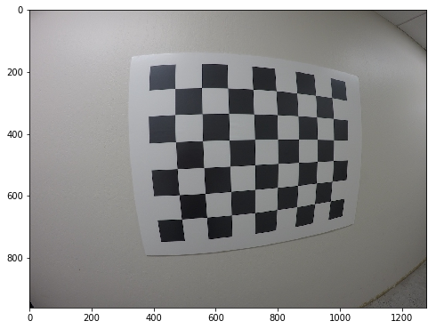
           <br>Chessboard image before calibration
      </p>
    </th>
    <th>
      <p align="center">
           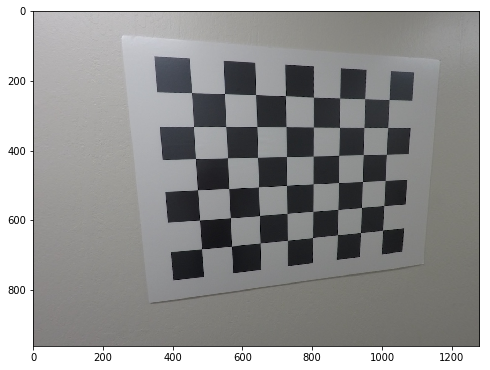
           <br>Chessboard image after calibration
      </p>
    </th>
  </tr>
</table>

The code for this steps can be found as `get_camera_calib` in [utils.py](utils.py).


## Distortion Correction

After obtained the camera calibration matrix, we can use it to perform image distortion correction.

I applied this distortion correction to the test image using the `cv2.undistort()` function and obtained the following result (appreciating the effect of calibration is easier on the borders of the image):

<table style="width:100%">
  <tr>
    <th>
      <p align="center">
           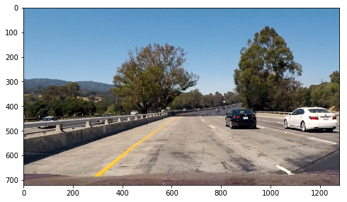
           <br>Road image before calibration
      </p>
    </th>
    <th>
      <p align="center">
           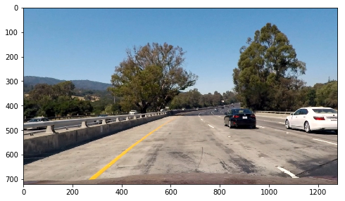
           <br>Road image after calibration
      </p>
    </th>
  </tr>
</table>

In this case appreciating the result is slightly harder, but we can notice nonetheless some difference on both the very left and very right side of the image.

## Thresholding

Correctly creating the binary image from the input frame is the very first step of the whole pipeline that will lead us to detect the lane. For this reason, I found that is also one of the most important. If the binary image is bad, it's very difficult to recover and to obtain good results in the successive steps of the pipeline. The code related to this part can be found in function  `thresh_transform_pipeline` at the bottom of the [notebook](./binarization_utils.py).

### Color Space

The first step of this pipeline is to apply a color space thresholding to the undistorted image. I decided to choose S channel in HLS color space which works great to pick up yellow line. I then applied a thresholds of (130, 255) to the image.

<table style="width:100%">
  <tr>
    <th>
      <p align="center">
           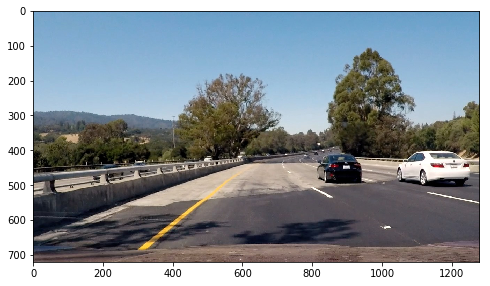
           <br>RGB image
      </p>
    </th>
    <th>
      <p align="center">
           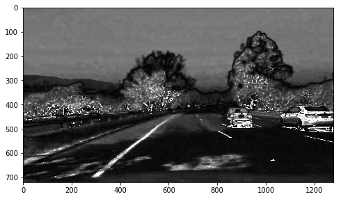
           <br>S color channel in HLS
      </p>
    </th>
  </tr>
</table>

### Sobel Gradient

Sobel is an important part in canny edge detection. Here I applied sobel detection along x axis of the image to detect the gradient along x axis. Then I applied a threshold of (32, 95) to the detection.

<table style="width:100%">
  <tr>
    <th>
      <p align="center">
           
           <br>RGB image
      </p>
    </th>
    <th>
      <p align="center">
           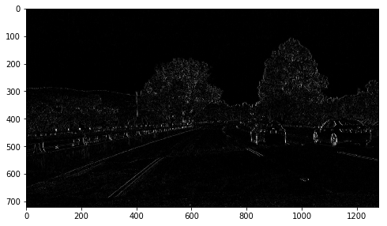
           <br>Sobel gradient along x axis
      </p>
    </th>
  </tr>
</table>


Then I combined above two binary images to build the stacked threshed image. The blue part is from S channel while green is from Sobel gradient.


## Perspective transform

Code relating to warping between the two perspective can be found in function `get_perspective` in [utils.py](./utils.py). This function used an image of straight view to calculate the perspective transformation matrix, `M`, and its inverse transformation matrix, `Minv`, which are needed to obtain the bird's-eye view of the scene. In order to perform the perspective warping, we need to map 4 points in the original space and 4 points in the warped space. For this purpose, both source and destination points are *hardcoded* as follows:

```
# define 4 source points
### top left - bottom left - bottom right - top right
src = np.float32([[592, 453],
                  [202, 720],
                  [1100, 720],
                  [685, 453]])
# define 4 destination points
dst = np.float32([[360, 0],
                  [360, 720],
                  [970, 720],
                  [970, 0]])
```

I verified that my perspective transform was working as expected by drawing the `src` and `dst` points onto a test image and its warped counterpart to verify that the lines appear parallel in the warped image.

<table style="width:100%">
  <tr>
    <th>
      <p align="center">
           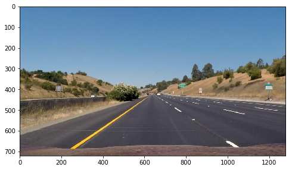
           <br>Road image of straight view
      </p>
    </th>
    <th>
      <p align="center">
           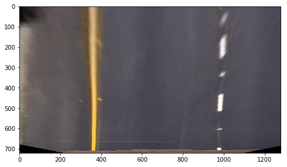
           <br>Warped image
      </p>
    </th>
  </tr>
</table>

## Lane Lines Pixels detection

### Peak analysis
Now I need to detect where the lane lines are in the image. My first step is to find the peak in the histogram of binary_warped image and use the peaks as the x coordinates base.


### Sliding Window

After obtained the base, in order to detect the remaining pixels in the frame, I considered two cases: 1. If this is the first frame of the video input or the new detected base changed over 30 pixels compared to the past, then I will conduct a `sliding window` mentioned below. 2. Otherwise, I will keep skip the this step and use recorded polynomial fit from last frame.

The `sliding window` is implemented in the main pipeline `output_pipeline` in the [notebook](./P4.ipynb).


## Curvature Calculation

After storing those pixels detected, I can use them to fit a polynomial:

```
# Extract left and right line pixel positions
leftx = nonzerox[left_lane_inds]
lefty = nonzeroy[left_lane_inds]
rightx = nonzerox[right_lane_inds]
righty = nonzeroy[right_lane_inds]

# Fit a second order polynomial to each
left_fit = np.polyfit(lefty, leftx, 2)
right_fit = np.polyfit(righty, rightx, 2)
```


Extracting the coefficients from the polynomial, I can compute the curvature of lane lines using:

```
left_curverad = ((1 + (2*left_fit_cr[0]*y_eval*ym_per_pix + left_fit_cr[1])**2)**1.5) / np.absolute(2*left_fit_cr[0])
right_curverad = ((1 + (2*right_fit_cr[0]*y_eval*ym_per_pix + right_fit_cr[1])**2)**1.5) / np.absolute(2*right_fit_cr[0])
```

# Pipeline

I warped all the above steps into a main pipeline `output_pipeline` which takes an raw_image and then return an image with lane lines detected and drawn.

In addition, I also warped another 2 pipelines in the support of making video of thresholding and sliding window output. They can be found at the bottom of this [notebook](./P4.ipynb). In summary:

`output_pipeline:` for generating the final output

`thresh_pipeline:` for generating the thresholding output

`sliding_window_pipeline:` for generating the sliding_window output

And I used MoviePy to generate the videos.

```
white_clip = clip1.fl_image(output_pipeline) # feed in different pipeline for making different video
output_video = 'output_images/' + output_video_name +'.mp4'
%time white_clip.write_videofile(output_video, audio=False)
```

# Result

## Test Images

Here is one example of final output on one test image:

<p align="center">
     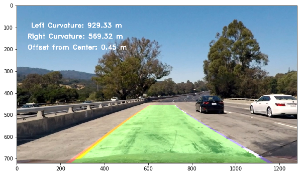
     <br>Result for test4.jpg
</p>

This is the result on the 6 test images:

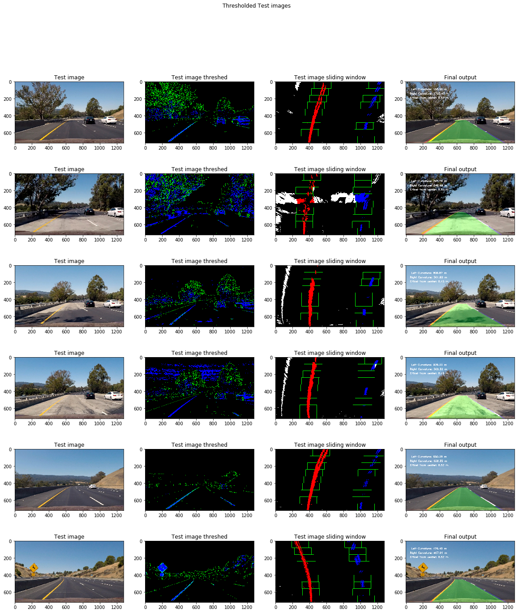

## Video

This is my final output for the project video:

<p align="center">
 <a href="https://youtu.be/SZIahz1Dr5M"></a>
 <br>Click for full video
</p>


### Discussion

#### Briefly discuss any problems / issues you faced in your implementation of this project.  Where will your pipeline likely fail?  What could you do to make it more robust?
I had some difficulties in tuning the thresholds to fit the video at the begining. Also, I spent dedicated effort to think how to handle the case when the detection was not accurate. So for my pipeline, it will most likely fail when lightness of the image changes. Some fellow students mentioned some excellent tricks to handle those cases but I feel those approaches with purely computer vision are still limited.
We should deploy ML/DL into the pipeline too which I will try them out soon!
